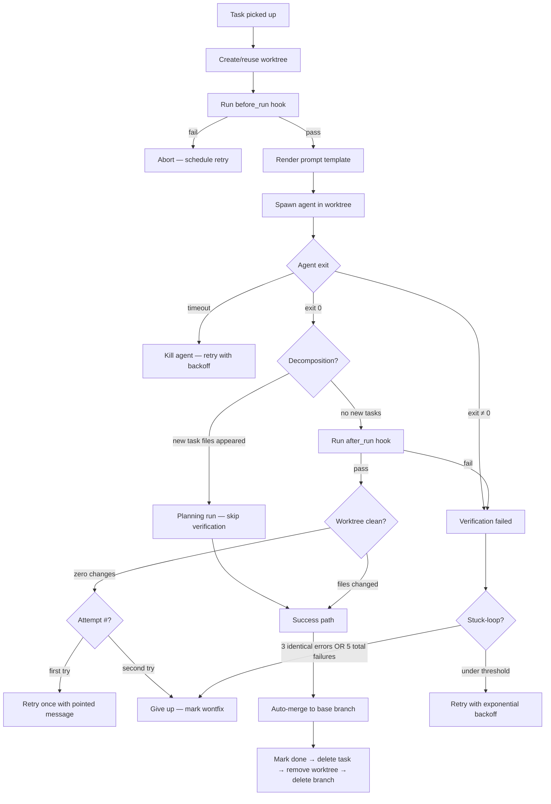
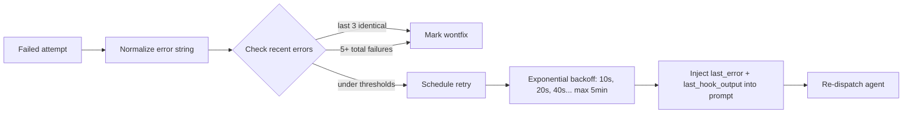

# Cacophony

**Autonomous multi-agent coding on autopilot.**

*Still hitting a few false notes. But the show goes on.* You describe a task; cacophony hands it to an AI coding agent, checks that the result actually builds and passes tests, and merges it into your project. If something breaks, it retries with the error context. You come back to landed commits.

Under the hood, cacophony is an outer-loop harness for CLI coding agents like Claude Code, Codex, Qwen Code, Aider, or Gemini CLI. The agents have their own inner loop (read files, run commands, iterate on a single task). Cacophony is what happens *between* agent invocations — queuing, isolation, retry, pre-task refinement, post-task verification, merge, cleanup. If you've used GitHub Actions or Jenkins, the shape will feel familiar; the difference is the work unit is a non-deterministic LLM session instead of a deterministic build.

The name is a nod to [Symphony](https://github.com/symphony-framework/symphony), an early multi-agent orchestration project that inspired the initial design. Where symphony aimed for coordinated harmony, cacophony leans into the reality — multiple agents running loose in your repo, occasionally producing noise, but getting work done.

## What it does

Cacophony is a daemon you run **inside your project's git repo**:

1. Watches `.cacophony/tasks/` (a local directory of markdown files) for work, or a custom adapter
2. Optionally runs a short "brief" LLM call first to refine ambiguous prompts into actionable tasks
3. Creates a git worktree per task under `.cacophony/worktrees/` — each on its own branch
4. Runs a coding agent in that worktree (Claude Code, Codex, Aider, Qwen Code, or any CLI tool)
5. Runs your verification hook (`npm test`, `pytest`, `cargo build`, etc.) against the result
6. Auto-merges the branch into the base branch if the hook passes; preserves it for manual review if not
7. Manages concurrency, retries with exponential backoff, and a full lifecycle hook chain
8. Persists all state to SQLite — survives crashes and restarts
9. Serves a web dashboard for queuing tasks, browsing run history, and viewing build logs

You manage work. Cacophony manages agents.

## Install

```bash
npm install
npm run build
```

Requires Node.js 18+ and Git. On Windows, Git for Windows is required — cacophony runs hook scripts via Git Bash (`bash.exe`), not `cmd.exe` or PowerShell, so bash syntax (`&&`, `$()`, pipes) works cross-platform.

## Quick start

Run from inside any git repository:

```bash
cd my-project
cacophony start           # dashboard on http://localhost:8080
```

If no config exists yet, the dashboard opens to a setup screen where you pick your coding agent, model, and concurrency. One click and you're running.

Pass `--port N` to use a different port, or `--no-server` to run headless.

Cacophony creates a `.cacophony/` directory inside your project for its state and worktrees — everything is scoped to that one repo.

```
my-project/
├── .cacophony/              # state, auto-gitignored
│   ├── config.md            # workflow + agent config (front matter + prompt)
│   ├── cacophony.db
│   ├── tasks/               # markdown task files
│   └── worktrees/
│       └── fix-login/       # git worktree on branch cacophony/fix-login
├── .git/
└── src/
```

Cacophony's design rule: **finished code lives at the project root; everything in-progress, scratch, or local-only lives under `.cacophony/`**.

### Dev mode (no build step)

```bash
npx tsx /path/to/cacophony/src/index.ts start --port 8080
```

## How worktrees work

Each task gets its own git worktree — a separate working directory that shares the main `.git/` with your repo. Worktrees are fast to create (no cloning), disk-efficient (shared objects), and give each agent a fully isolated workspace on its own branch.

When cacophony picks up an issue:

1. Fetches latest from `origin/<base-branch>` (best-effort)
2. Creates a worktree at `.cacophony/worktrees/<id>/` on a new branch `cacophony/<id>`
3. Runs your agent with `cwd` set to that worktree
4. When the agent finishes (success, failure, or cancellation), removes the worktree

The agent can commit, push, open PRs, and merge — it's a real branch in your repo.

## File-based tracker

Just markdown files inside `.cacophony/tasks/` — no API keys, no remote services:

```
my-project/
└── .cacophony/
    ├── config.md
    └── tasks/
        ├── fix-login-bug.md
        └── add-dark-mode.md
```

Tasks are most easily created and edited from the web dashboard, but you can hand-edit the markdown files directly. Each file has YAML front matter:

```yaml
---
state: todo
priority: 1
blocked_by: [setup-auth]
---

# Fix login bug

Users can't log in after session timeout.
```

Drop a file in `tasks/` and cacophony picks it up. Or manage everything from the web dashboard — create, edit, reorder, delete.

## Configuration reference

The `.cacophony/config.md` file uses YAML front matter for config and a Liquid template body for the agent prompt. You can edit it by hand or use the settings panel in the dashboard (gear icon in the header). If no config exists when you run `cacophony start`, the dashboard opens to a setup screen where you pick your agent and model — the config file is generated for you.

Legacy `WORKFLOW.md` at the project root is still loaded as a fallback with a deprecation hint.

### `tracker` (optional)

| Field | Type | Default | Description |
|---|---|---|---|
| `kind` | string | `"files"` | `"files"` is the only built-in tracker; any other value is resolved as a filesystem path to a custom adapter plugin (see [Custom tracker plugins](#custom-tracker-plugins)) |
| `dir` | string | `".cacophony/tasks"` | Directory for task files (used by the files tracker) |
| `active_states` | string[] | `["todo", "in-progress"]` | States that mark issues as active |
| `terminal_states` | string[] | `["done", "cancelled", "wontfix"]` | States that mark issues as done |

### `agent`

| Field | Type | Default | Description |
|---|---|---|---|
| `command` | string | *required* | Shell command to run. Supports Liquid: `{{prompt_file}}`, `{{workspace}}`, `{{identifier}}`, `{{attempt}}` |
| `prompt_delivery` | string | `"file"` | How the prompt reaches the agent: `"file"`, `"stdin"`, or `"arg"` |
| `timeout_ms` | number | `3600000` | Kill agent after this many ms (1 hour default) |
| `max_concurrent` | number | `5` | Max agents running simultaneously |
| `max_turns` | number | `20` | Max retry turns per issue |
| `max_retry_backoff_ms` | number | `300000` | Max backoff delay for failed retries (5 min) |
| `max_concurrent_by_state` | object | `{}` | Per-state concurrency limits, e.g. `{ "todo": 2 }` |
| `env` | object | `{}` | Extra environment variables for agent subprocess |

### `workspace` (optional)

| Field | Type | Default | Description |
|---|---|---|---|
| `project_root` | string | `.` | Git repo root. Worktrees live in `<project_root>/.cacophony/worktrees/`. |
| `base_branch` | string | auto-detect | Branch to base new worktrees on. Auto-detects `origin/HEAD`, then `main`, then `master`. |

### `hooks` (optional)

Shell scripts that run at worktree lifecycle points. All execute with the worktree as `cwd`. Bash required (uses Git Bash on Windows).

| Field | Description |
|---|---|
| `after_create` | Runs once after a worktree is first created. Best-effort pre-warm (e.g. dep bootstrap) — failure is logged but the run continues, so empty/fresh projects don't get stuck on `npm install` before a `package.json` exists. For hard setup gates, use `before_run` or guard inside the script. |
| `before_run` | Runs before each agent attempt. Failure aborts the attempt. |
| `after_run` | Verification gate. Runs after each agent attempt. **If it exits non-zero, the attempt is rejected even when the agent exited 0** — no auto-merge, branch is preserved, task is retried. Typical use: `npm test`, `pytest`, `cargo test`, `go test`, lint/type checks. |
| `before_remove` | Runs before worktree deletion. Failure is logged and ignored. |
| `timeout_ms` | Timeout for all hooks (default: 60000) |

Typical uses:

```yaml
hooks:
  after_create: |
    # Fast dep bootstrap: clone node_modules from the main checkout via
    # copy-on-write (macOS APFS) or fallback copy. Instant instead of
    # running npm install per worktree.
    if [ -d ../../../node_modules ]; then
      cp -Rc ../../../node_modules . 2>/dev/null || cp -r ../../../node_modules .
    else
      npm install --prefer-offline
    fi
  after_run: |
    npm run lint && npm run typecheck && npm test
```

The `after_run` hook is the single most important thing to configure if you want cacophony to genuinely verify agent work. Without it, cacophony trusts the agent's exit code; with it, every successful run has passed your quality gate.

When the brief detects a JS/TS project, it suggests an appropriate `after_run` hook (e.g. `npx svelte-check && npx vitest run && npx biome check --write .`). If you accept the suggestion and no `after_create` hook is configured yet, cacophony auto-sets the `node_modules` bootstrap hook above — so dependencies are available when the verification runs.

### `polling`

| Field | Type | Default | Description |
|---|---|---|---|
| `interval_ms` | number | `30000` | How often to poll the tracker (30s default) |

### `brief` (optional)

Before dispatching a task, cacophony can run a short LLM call (the "brief") that either refines a vague user prompt into a clearer one or asks up to 3 clarifying questions. The brief reuses the same agent command configured in `agent.command`, so it's zero extra setup — it just uses a different prompt. If the brief fails, times out, or returns unparseable output, cacophony falls back to the raw prompt and the task still runs.

| Field | Type | Default | Description |
|---|---|---|---|
| `enabled` | boolean | `true` | Run the pre-task brief before dispatching |
| `max_rounds` | number | `2` | Max clarification rounds before forcing a ready verdict |
| `timeout_ms` | number | `45000` | Per-round timeout for the brief subprocess |

To disable entirely:

```yaml
brief:
  enabled: false
```

Or on a per-task basis, tick the **Skip brief** checkbox in the dashboard before clicking Run.

### `server` (optional)

| Field | Type | Default | Description |
|---|---|---|---|
| `port` | number | `8080` | Dashboard / HTTP API port. Override with `--port N` or disable with `--no-server`. |

## Dependencies between tasks

Tasks can declare blockers so agents run in the right order. Use the `blocked_by` front matter field:

```yaml
---
state: todo
blocked_by: [setup-database, create-user-model]
---

# Add login endpoint
```

Cacophony skips any task whose blockers aren't in a terminal state.

## Agent examples

Cacophony runs any CLI tool:

**Claude Code:**
```yaml
agent:
  command: "claude -p {{prompt_file}} --output-format stream-json --verbose --dangerously-skip-permissions"
  prompt_delivery: file
```

**Codex:**
```yaml
agent:
  command: "codex --prompt {{prompt_file}}"
  prompt_delivery: file
```

**Aider:**
```yaml
agent:
  command: "aider --message-file {{prompt_file}} --yes"
  prompt_delivery: file
```

**Custom script:**
```yaml
agent:
  command: "python ./scripts/agent.py --task {{prompt_file}} --workspace {{workspace}}"
  prompt_delivery: file
```

## Custom tracker plugins

> **Status: dormant extension point, no maintained plugins.**
> Cacophony's tracker layer used to support multiple backends (GitHub Issues, Linear). Those were removed to focus on the local files-only flow, but the pluggable interface stayed so anyone who needs a non-`files` task source can wire one up without forking. No custom plugins are maintained or shipped today — if you build one, you own it. This section is documentation of the extension point for hackers, not a plugin ecosystem.

Create a JS/TS file that exports a factory function:

```typescript
// my-tracker.js
export default function createTracker(config) {
  return {
    kind: 'my-tracker',

    async fetchCandidates() {
      // Return Issue[] -- active issues to work on
    },

    async fetchIssueStatesByIds(ids) {
      // Return { id, identifier, state }[] for given issue IDs
    },

    async fetchTerminalIssues() {
      // Optional: return Issue[] in terminal states (for cleanup)
    },

    async setIssueState(issueId, state) {
      // Optional: cacophony calls this to mark a task done after a successful run.
      // If omitted, cacophony falls back to scheduling a continuation retry.
    },
  };
}
```

Reference it in your workflow:

```yaml
tracker:
  kind: "./my-tracker.js"
```

## Prompt template

The body of `.cacophony/config.md` (below the front matter) is a [Liquid](https://liquidjs.com/) template. Available variables:

| Variable | Type | Description |
|---|---|---|
| `issue.id` | string | Tracker-internal ID |
| `issue.identifier` | string | Human-readable key (e.g. `fix-login`) |
| `issue.title` | string | Issue title |
| `issue.description` | string | Issue body/description |
| `issue.priority` | number or null | Priority (lower = higher) |
| `issue.state` | string | Current state |
| `issue.url` | string or null | Link to the issue, if any |
| `issue.labels` | string[] | All labels (lowercase) |
| `attempt` | number or null | Retry attempt number (null on first run) |
| `last_error` | string or null | Error message from the previous failed run (only on retries) |
| `last_hook_output` | string or null | Full build/test output from the previous failed run (up to 10KB, only on retries) |
| `config` | object | Full config from `.cacophony/config.md` |
| `tasks_dir` | string | Absolute path to `.cacophony/tasks/` (used by agents that self-decompose) |
| `project_root` | string | Absolute path to the project root |

## How it works

### Poll loop

Every `polling.interval_ms`, cacophony:

1. **Reconciles** running agents against the tracker (kills agents for terminal/inactive tasks)
2. **Fetches** candidate tasks from the tracker
3. **Sorts** by priority (ascending), then creation date (oldest first)
4. **Skips** tasks whose blockers aren't yet resolved
5. **Dispatches** eligible tasks until concurrency limit is reached

### Dispatch → verify → land pipeline

The full lifecycle of a single task dispatch:



### Retry and failure handling



Error normalization strips timestamps (`HH:MM:SS`), dates (`YYYY-MM-DD`), worktree paths, and durations (`Nms`) before comparing — so the same build error at different times counts as identical.

### Retry context injection

On retries, the prompt template receives two extra variables:

- **`last_error`** — the error message from the previous failed run (tail 500 chars)
- **`last_hook_output`** — the full build/test/lint output from the previous run (up to 10KB)

This gives the agent the exact failure context, which is the single biggest factor in retry success rates. Without it, the agent re-reads files and guesses what went wrong; with it, the agent can jump straight to the failing line.

### Success path detail

When an agent exits 0, the `after_run` hook passes, and the worktree has changes:

1. **Auto-merge** the `cacophony/<id>` branch into the base branch (fast-forward or merge commit). If the project root is dirty or on a different branch, the merge is skipped and the branch preserved.
2. **Mark done** via the tracker's `setIssueState`.
3. **Delete the task file** — the merged commits and SQLite run history are the durable record.
4. **Remove the worktree** and auto-commit any uncommitted changes first.
5. **Delete the branch** (only after the worktree is gone, since git refuses to delete a checked-out branch).

### No-changes detection

If the agent exits 0 and all hooks pass but the worktree has no meaningful changes — no uncommitted modifications and no new commits beyond the base branch — the agent didn't actually do any work. Cacophony:

- **First attempt**: retries once with a pointed error message telling the agent to re-read the requirements and make specific changes.
- **Second attempt with no changes**: gives up and marks the task `wontfix`. The task likely needs a more specific prompt.

The check accounts for work committed on previous attempts: if a prior run committed files but the current retry made no further changes, the branch still has real work and goes through the normal success path.

### Decomposition detection

Agents can self-decompose a large task into subtasks by writing new `.md` files into `.cacophony/tasks/`. Cacophony snapshots the task directory before each run and diffs afterward. If new files appeared, the run is treated as a planning run — the `after_run` verification hook is skipped (there's no code to build), and the parent task completes normally. The new subtask files are picked up on the next poll cycle.

### Stuck-loop prevention

Two triggers cause cacophony to give up on a task:

| Trigger | Threshold | Rationale |
|---|---|---|
| Same error repeating | 3 identical failures | Agent can't self-correct this error |
| Total failure cap | 5 cumulative failures | Agent is thrashing between different errors |

When either fires, the task is marked `wontfix` (a terminal state, so the poll loop stops re-dispatching it). The user can change it back to `todo` from the dashboard to retry with a different approach.

### Worktree safety

- Identifiers are sanitized to valid git branch names (`[A-Za-z0-9._-]`, no leading dots, no `..`)
- Worktree paths are verified to be under `.cacophony/worktrees/` (no path traversal)
- Stale worktrees are pruned on startup via `git worktree prune`
- Failed worktree creation cleans up with `git worktree remove --force`
- Each task works on its own branch `cacophony/<identifier>`
- **Secret protection**: every new worktree gets common secret patterns (`.env`, `.env.*`, `*.pem`, `*.key`, `credentials.json`, `config.js`, etc.) auto-appended to its `.gitignore` — so agents can't accidentally commit API keys or credentials, even if the project's own `.gitignore` doesn't cover them

### Security: what the agent can and cannot access

Coding agents run with `--dangerously-skip-permissions` (Claude Code), `--yolo` (Qwen Code), `--yes` (Aider), or equivalent flags that disable interactive tool-call approval. This is required for background autonomous operation — without it, the agent would hang waiting for a human to click "Allow" on every file write and shell command.

**There is no process-level sandbox.** The agent runs as your OS user with your full permissions:

- **Filesystem**: can read and write any file your user account can access — not just the worktree, but `$HOME`, other projects, config files, SSH keys, etc. The worktree `cwd` is a hint, not a wall; `cd ..` or absolute paths are not blocked.
- **Network**: can make any HTTP request, connect to APIs, download or upload data.
- **Environment**: inherits all exported environment variables (`OPENAI_API_KEY`, `GITHUB_TOKEN`, `AWS_SECRET_ACCESS_KEY`, etc.) and anything set via `agent.env` in the config.
- **Shell**: can run any command on `$PATH` — `curl`, `rm`, `git push`, `ssh`, `docker`, system utilities.

**What cacophony's worktree isolation does protect:**

- Your **main branch** is never modified until the verification gate (`after_run`) passes and auto-merge succeeds. Broken or malicious agent output stays on a `cacophony/<id>` branch until explicitly merged.
- Agent work is **auto-committed before cleanup**, so even if an agent run goes sideways, the git branch preserves what happened for inspection.

**What it does NOT protect:**

- The agent can modify files outside the worktree, make network calls, or run destructive commands during the session. The worktree is a git-level isolation, not a process-level sandbox.
- If the agent reads a secret from your environment and writes it to a file it commits, that secret ends up in git history.

**Mitigation options for higher-security environments:**

- Run cacophony inside a **Docker container** with only the project directory mounted and no host network.
- Use a dedicated **VM or cloud instance** with minimal credentials.
- Set `agent.env` in the config to pass only the specific env vars the agent needs, rather than inheriting the full shell environment.
- Wrap the `agent.command` in a sandbox (`docker run ...`, `firejail`, etc.) — the command field is a shell string, so any wrapper works.

For local development on your own machine with your own prompts, the practical risk is low — you control the inputs and the agent uses your own API keys. For shared servers, CI pipelines, or multi-tenant setups, containerization is strongly recommended.

## Web dashboard

The dashboard is a single-file Alpine.js app served from the daemon. Monospaced JetBrains Mono typography, flat grayscale palette, red/green accents reserved for status indicators. Features:

- **Setup screen** — shown on first run when no config exists. Pick your coding agent, model, and concurrency — config is generated and the orchestrator boots immediately.
- **Settings panel** — gear icon in the header. Change agent/model, hooks, brief settings, and concurrency without editing YAML. Changes are hot-reloaded.
- **Running agents** — live view with elapsed time and one-click stop
- **Stats** — active / done / failed counters, clickable to filter
- **Task list** — filterable (active / failed / done / all) with search, parent/child hierarchy indentation
- **Task status tags** — running (green dot), failed (red), pending (gray, reopened from failure), blocked
- **Brief modal** — clarification questions with radio-button options when the brief agent needs more context
- **Task detail modal** — description, blockers, run history, error output, collapsible per-run build log
- **Dark / light theme toggle** — sun/moon icon in the header; persisted to `localStorage`
- **Keyboard shortcuts** — `/` to focus search, `Esc` to close modals
- **Task creation** — single prompt textarea with optional "skip brief" checkbox
- **Bulk clear** — wipe all tasks matching the current filter + search
- **Auto-apply hooks and skills** — when the brief detects a framework, verification hooks and community skill packs are installed automatically in the background with a toast notification (no blocking prompts)

**API endpoints:**

| Method | Path | Description |
|---|---|---|
| `GET` | `/` | Dashboard HTML |
| `GET` | `/api/v1/status` | Orchestrator state (running, retrying, claimed, trackerKind, activeStates, terminalStates, briefEnabled, briefMaxRounds). Returns `{ needsSetup: true }` when no config exists. |
| `GET` | `/api/v1/setup/presets` | Available agent presets (name, models, delivery) for the setup screen |
| `POST` | `/api/v1/setup` | Create config and boot orchestrator `{ agent, model?, maxConcurrent?, customCommand?, customDelivery? }` |
| `GET` | `/api/v1/runs?limit=N` | Recent run history (includes `prompt`, `hookOutput`, and `error` fields) |
| `GET` | `/api/v1/tasks` | All tasks (files tracker only) |
| `POST` | `/api/v1/tasks` | Create task `{ prompt, priority? }` (identifier is auto-generated from the prompt) |
| `POST` | `/api/v1/brief` | Run a brief round `{ transcript: [{ role: "user"\|"assistant", content }] }` → `{ status: "ready" \| "clarify", ... }` |
| `PUT` | `/api/v1/tasks/:id/state` | Update task state `{ state }` |
| `DELETE` | `/api/v1/tasks/:id` | Delete task (removes the .md file, all runs, issues cache, pending retries) |
| `POST` | `/api/v1/stop/:id` | Cancel running agent |
| `POST` | `/api/v1/skills/install` | Install a community skill pack `{ framework }` (clones, renames, commits) |
| `GET` | `/api/v1/skills/status` | Check if skills are installed `{ installed: boolean }` |
| `GET` | `/api/v1/config` | Current config (agent, hooks, brief) |
| `PUT` | `/api/v1/config` | Update config fields `{ agent?, hooks?, brief? }` (merges into YAML, triggers hot-reload) |
| `POST` | `/api/v1/config/hooks` | Update verification hooks `{ after_run }` (merges into config YAML, triggers hot-reload) |

## Development

```bash
npm run dev              # Run with tsx (no build step)
npm test                 # Run tests
npm run test:watch       # TDD watch mode
npm run test:coverage    # Coverage report
npm run lint             # ESLint
npm run format           # Prettier
npm run check            # Full pipeline: lint + format + test + build
```

## Architecture

```
src/
  index.ts              CLI entry point (init/start/status/stop), HTTP server + API
  orchestrator.ts       Poll loop, dispatch, reconciliation, blocker enforcement
  outcome.ts            Pure classifier for agent-run outcomes (testable decision tree)
  config.ts             Config file parser, validator, hot-reload watcher
  state.ts              SQLite store (runs, retries, issues, metrics)
  workspace.ts          Git worktree lifecycle, hooks, safety checks, branch naming
  runner.ts             Agent subprocess management
  retry.ts              Exponential backoff, persistence, timer restoration
  brief.ts              Pre-task LLM intake (clarify or ready, framework detection)
  template.ts           Shared Liquid instance, typed prompt/command/brief contexts
  skills.ts             Community skill pack registry, clone + install
  slug.ts               Prompt-to-identifier slug generation
  logger.ts             Structured JSON logging, terminal status
  dashboard.ts          Reads the static dashboard assets and splices them together
  dashboard/
    index.html          Dashboard markup (Alpine.js directives)
    styles.css          Dashboard styles
    app.js              Alpine app() function and state
  types.ts              Shared type definitions + ISSUE_STATES constants
  trackers/
    interface.ts        TrackerAdapter interface, factory
    files.ts            Local markdown files (with blocked_by support, LocalTaskStore capability)
```

**Tracker capabilities.** `TrackerAdapter` is the minimum contract every tracker implements (discover candidates, refresh states, optionally advance or delete). Task-file CRUD and a local tasks directory live on a separate `LocalTaskStore` capability interface that only `FilesTracker` implements today — remote trackers (Linear, GitHub, …) can't reasonably provide those, so forcing them onto every adapter would rot the first time a second tracker existed. The dashboard gates file-specific UI (task creation, delete, state transitions) on the capability, not on `kind === 'files'`.

**Orchestrator split.** `orchestrator.ts` handles effects (subprocess, git, DB, tracker calls); the decision tree — timeout vs no-changes vs success vs failed-retry vs stuck-loop — lives in `outcome.ts` as a pure function with a unit-tested discriminated union. Adding a new retry policy or exit condition means extending one small file, not surgery on a 300-line method.

### Runtime dependencies

| Package | Purpose |
|---|---|
| `better-sqlite3` | Persistent state (runs, retries, metrics) |
| `yaml` | Parse config front matter |
| `liquidjs` | Render prompt templates |
| `chokidar` | Watch the config file for hot-reload |
| `chalk` | Terminal output formatting |

Everything else uses Node.js builtins: `child_process`, `fs`, `path`, `http`, `crypto`.

## License

MIT
